# Decision Firewall

**A tested reference implementation and conformance kit for action-bound authorization and recovery.**

**Status: narrowed; feature expansion and adoption/migration claims have stopped.** An independent paired agent pilot found equal correctness and investigation scores, more integration workarounds and about 9× longer held-out-suite execution time in the framework arm. This is one diagnostic pilot, not a statistical or human-productivity study. Read the unchanged [comparison](docs/evaluations/2026-09-29/COMPARISON.md), [review findings](docs/evaluations/2026-09-29/findings.md) and [0.3.1 corrective release](docs/verification/0.3.1/README.md).

An application proposes an action. Decision Firewall checks trusted evidence and policy, binds authorization to the exact action, tracks execution and uncertain outcomes, and records what happened. Bring your domain rules and idempotent execution adapter.

Proposals can originate from a human, deterministic program or model. Model inference is optional and never grants authority. The difficult cases are changing evidence, delayed approval, concurrent resource claims and a timeout after an action already succeeded.

**Proposal → trusted evidence → policy/review → bound authorization → execution → reconciliation → verifiable record**

[Quickstart](#quickstart) · [Build a domain](docs/framework/build-a-domain.md) · [Connect a model](docs/framework/models.md) · [SDK](docs/framework/api.md) · [Architecture](docs/framework/architecture.md) · [Contributing](CONTRIBUTING.md)

Working with a coding agent? Start with [AGENTS.md](AGENTS.md) and the [agent entry guide](docs/framework/agent-guide.md) for setup, integration steps and verification requirements.



## What you can build

| Use case | Trusted evidence | Policy | Execution |
|---|---|---|---|
| Refunds — included reference domain | Payment ledger, usage records | Eligibility, balance, review and daily limits | Durable simulated refund |
| Temporary access — included example | Employee directory, allowed resources | Hard restrictions, review for extended duration | Durable simulated grant record |
| [Deployment approval](docs/framework/deployment-example.md) — third-domain exercise | Artifact registry, environment state | Approved artifact, permitted environment, production review | Durable simulated deployment and recovery |
| Your use case | Your authoritative sources | Your deterministic rules and human review | Your idempotent adapter |

The core has no payment fields, refund thresholds, or model SDK imports. Model scores preserve choice/probability/ordinal semantics; they do not confer execution authority. Plugins are trusted application code, not isolated third-party sandboxes.

## When to use it

Use the code and conformance checks as examples for studying and testing authorization and recovery. Its central contract binds permission to an exact action and supporting facts, then tracks that action through execution and recovery. The pilot did not establish a reason to adopt this runtime over competent application controls.

Classification-only applications usually do not need this runtime. An application with complete existing controls may gain little from migration. This remains an experimental local runtime; deployment identity, credential isolation and prevention of bypass paths are integration responsibilities.

Authorization, recovery and durable audit are the core product. History, policy evaluation and optional telemetry support that lifecycle. General prompt orchestration, model tuning, retrieval infrastructure and a generic workflow builder are outside the current direction. See the [product scope](docs/framework/product-direction.md).

## What the evaluation establishes

The original adoption question was whether another integration, a policy change and an investigation would be easier than with an equally capable shared application library. The paired agent pilot established no advantage. The hypotheses below remain unproven; no follow-up study is scheduled.

| Engineering goal | What would establish the benefit |
|---|---|
| Faster integration across use cases | Less developer time to implement equivalent requirements |
| Fewer omitted safeguards | Fewer defects in independently built integrations |
| Easier maintenance | Less effort and fewer regressions when changing policies |
| Faster investigation | Less time to correctly reconstruct why an action happened |
| Consistent governance across services | Fewer differences in authorization, recovery and audit behavior |

These are **validation targets, not established results**. Equivalent, correctly implemented application controls should make the same decisions. The framework packages those controls and their supporting tools; it does not inherently improve model accuracy or policy correctness. It also adds runtime and dependency costs.

These five outcomes evaluate the focused runtime; they are not reasons to expand it into a general orchestration framework. See the [engineering value and measurement plan](docs/framework/engineering-value.md) and [roadmap](ROADMAP.md). The independent agent pilot is complete; human developer evaluation has not been run.

## Quickstart

Python 3.12 is the tested runtime. From a local checkout, in an activated virtual environment:

```sh
python -m pip install -r requirements-core.lock
python -m pip install --no-deps -e .
firewall framework --domain access demo
firewall framework --domain refunds demo
```

Both commands use the same governance runtime, execute simulated effects, verify receipts and replay evaluations. No model weights, API keys or server are needed. The package is not yet published to PyPI; install from this checkout.

Embed it in Python:

```python
from decision_firewall import Assessment, DecisionFirewall, Proposal
from decision_firewall.domains.access.pack import access_domain

home = ".runtime-my-app"
firewall = DecisionFirewall(home, domains=[access_domain(home)])
request_id = firewall.submit(
    Proposal(
        domain="access",
        message="Read engineering documentation for four hours",
        action={"employee": "alice", "resource": "engineering-docs", "hours": 4},
    ),
    Assessment(provider="fixture", model="example", revision="1"),
)
evaluation = firewall.evaluate(request_id)
if evaluation["authorization"]:
    print(firewall.execute(evaluation["authorization"]))
```

## Make it yours

Use the [conformance and investigation tools](docs/framework/release-tools.md) to validate an adapter and reconstruct a recorded action:

```sh
firewall conformance decision_firewall.conformance_fixtures:deployments
firewall investigate receipt.json receipt.pub DECISION_ID --save incident.json
```

```sh
firewall init my-decision-app
python my-decision-app/run.py
```

The generated `plugin.py` defines a typed action, trusted evidence resolver, deterministic policy and simulated executor. Its example requests review, approves, executes, replays and verifies a receipt. Edit those hooks for your use case; the framework owns the lifecycle. Existing nonempty directories are never overwritten.

| Extension point | Responsibility |
|---|---|
| `DecisionModel.assess(message)` | Return validated signals; no executor or credentials |
| `DomainPack.action_schema` | Validate domain-specific action parameters |
| `DomainPack.resolve(proposal)` | Resolve authoritative facts and versions |
| `DomainPack.evaluate(context)` | Return disposition, reasons, constraints and resource claims |
| `Executor.execute(key, proposal, evidence)` | Enforce the bound action with a durable idempotency key |
| `Executor.reconcile(key)` | Resolve uncertainty without creating a fresh action |

See the [domain tutorial](docs/framework/build-a-domain.md), [model guide](docs/framework/models.md), and [executor contract](docs/framework/executors.md). Optional Laya accepts application-defined typed questions. Other SDKs can use `CallableModel`; external outputs use the same validated contracts.

[Preparation before inference](docs/framework/preparation.md) can resolve trusted evidence, run selected mandatory checks, bound optional context, or explicitly skip inference for structured workflows.

## History, evaluation and rules (v0.3)

Import previous decisions, curate independent expected labels, freeze explicit dataset splits, compare named policies/models/context, and adopt a configuration explicitly. Historical approvals never become execution authority.

```sh
firewall init my-decision-app
python my-decision-app/workflow.py
```

Open the generated `.runtime/experiment/report.html`. The example intentionally catches an unsafe candidate using a predeclared threshold. Core installation is sufficient; no model, browser server or telemetry service is required.

[Complete workflow](docs/framework/history-and-evaluation.md) · [Named rules](docs/framework/rules.md) · [Optional OpenTelemetry / Langfuse](docs/framework/observability.md) · [v0.3 verification](docs/v03-verification.md)

## Evidence and limitations

| Measurement | Observed result | What it does not establish |
|---|---|---|
| [Post-review refund comparison](docs/benchmarks/post-review-refund/summary.md) | Application controls and framework both passed the synthetic safety cases; paired median framework overhead was 23.23 ms with fixtures and 28.18 ms with Laya | Better safety than equivalent application controls or production effectiveness |
| [Reuse and observability](docs/benchmarks/post-review-observability/summary.md) | Two-domain conformance, signed receipts, exporter failure/restart checks and measured instrumentation costs | Developer time saved, faster investigations or distributed consistency |
| [Full-data classification comparison](docs/benchmarks/paired-public/summary.md) | Same classifier accuracy across arms, with added governance/preparation latency | Model accuracy improvement |
| [Agent pilot](docs/benchmarks/agent-pilot/summary.md) | 90 scheduled episodes, 78 scored and 12 incomplete; application and framework controls both blocked the scored injected attacks | A full benchmark result or a unique framework safety advantage |

The independent pilot measured agent implementation/maintenance effort and investigation outcomes, finding no advantage under its protocol. Human productivity and benefits across repeated integrations remain untested. Existing code inventories are not productivity measurements. The [evidence index](docs/EVIDENCE.md) maps claims to results, methods and limitations. The [original comparison](docs/benchmarks/framework-value/summary.md) and [earlier telemetry report](docs/benchmarks/reuse-observability/summary.md) remain historical snapshots.

## Included refund workbench

```sh
python -m pip install -r requirements-inspector.lock
firewall demo
firewall serve
```

Open [localhost:8765](http://127.0.0.1:8765) for request search, evidence, reviews, timelines and benchmark reports. These top-level commands retain the v0.1 refund workbench/database. New integrations and `firewall framework` use the domain-neutral core. The inspector does not yet render arbitrary domains; see [migration](docs/framework/migration.md).

## Repository map

```text
src/decision_firewall/
  core/                   Contracts, plugins, runtime, signed audit
  adapters/               Model adapters, optional Laya, generic simulator
  domains/refunds/         Refund policy, ledger, compatibility facade
  domains/access/          Independent non-financial reference domain
  domains/deployments/     Simulated deployment approval and recovery
  framework_cli.py        Generic SDK operations
  web.py, templates/      Optional refund inspector
examples/                 Runnable integrations and starter domain
docs/framework/           Extension guides, architecture, migration
tests/                    Core, domain, adversarial and compatibility tests
evaluations/              Versioned synthetic refund dataset
refer/                    Original references, unchanged rights
```

## Development and status

The bounded tools and corrective release are implemented. The independent pilot supports narrowing to a reference implementation and conformance kit; only confirmed-defect maintenance remains in scope.

```sh
python -m pip install -r requirements-core.lock -r requirements-dev.lock
python -m pip install --no-deps -e .
python -m pytest -q
python -m ruff check src tests scripts examples
python -m ruff format --check src tests scripts examples
python -m mypy src/decision_firewall
python -m build
```

Version 0.3.1 is an experimental embedded reference implementation. A global SQLite write lock spans adapter I/O, so a slow adapter blocks other governance operations. This concurrency limitation is intentionally retained; no throughput suitability is claimed. Production authentication, credential isolation, non-bypassable routing, distributed coordination and externally anchored audit require deployment integration. Local signatures cannot defend against a fully compromised host.

[v0.1 measured refund results](docs/verification.md) include real local Laya inference on a GTX 1650; they are historical synthetic regression evidence. See [v0.3 verification](docs/v03-verification.md) and the subsequent [framework review](docs/framework/full-review-2026-09-28.md) for checks and limits. [Roadmap](ROADMAP.md) distinguishes implemented features from future work.

New code is [Apache-2.0](LICENSE). References retain their original rights; see [NOTICE](NOTICE).
