# Refund compatibility architecture

This describes the v0.1 refund workbench retained in v0.2. New integrations use the [domain-neutral framework architecture](framework/architecture.md).

`Firewall` owns the governance database. `PaymentSimulator` owns a separate payment database. Assessors receive only message text and cannot execute. The browser and CLI call the same SDK.

## Contracts and records

Pydantic rejects extra fields and non-integer money at the submission boundary. Proposals, assessments, payments/evidence, policy evaluations, reviews, authorizations, execution attempts, and outcome events have separate responsibilities. Proposal and assessment snapshots are preserved in signed events; evaluations preserve the exact policy inputs. Current request rows are projections for inspection.

The package exports `Firewall.submit`, `revise`, `evaluate`, `review`, `execute`, `reconcile`, `outcome`, `replay`, `detail`, and `list_requests`. `Provider.assess` returns an `Assessment`. Trusted local operator APIs seed/update evidence, change policy, and revoke identities/authorizations. These are not model-callable capabilities and are not exposed through the review web server.

## Execution protocol

1. Evaluate deterministic policy and persist the result and bound authorization in one firewall transaction.
2. Revalidate signature, exact ledger token, identity, expiry, proposal/evidence/policy/review bindings, and policy at execution time.
3. Atomically reserve refundable balance and daily allowance, assign a stable downstream idempotency key, and persist the audit event.
4. Acquire the firewall write lock again, confirm the reservation remains active, and dispatch. The lock excludes concurrent reconciliation.
5. The payment simulator atomically commits its idempotency record and refund. The firewall records success, failure, or uncertainty.

A crash after the payment commits but before the firewall commits leaves a durable reservation. Reconciliation queries the authoritative payment ledger using the same idempotency key. It does not infer failure from timeout. Only the simulator's authoritative absence, while holding the dispatch lock, permits a definitive failed result. A real asynchronous provider requires stronger absence semantics; this assumption must not be copied blindly.

SQLite transactions deliberately serialize local execution. This is a correctness sandbox, not a high-throughput gateway. No distributed exactly-once guarantee is claimed.

## Audit

RFC 8785 canonical JSON is hashed with SHA-256 and signed with Ed25519. Global events form a sequence with previous hashes; signed export checkpoints bind head and count. Verification requires a separately trusted public key. An export includes the full chain, so the single-operator inspector can verify global integrity. It is not a multi-tenant export API.

A locally signed checkpoint does not establish truthful evidence or defeat a compromised signing key. Independent external checkpoints and protected key storage are future production requirements. Retain/export known checkpoints separately to detect rollback to an earlier valid history.

Historical replay uses recorded model output, ledger context, review, daily usage, and pinned policy values with evaluator v1. It never calls the model. Evaluator changes must preserve/version old semantics before claiming replay compatibility.

