# Evaluation methodology

The dataset contains 20 curated scenario families with two authored messages each, plus 200 seeded greeting/signoff variations. Family index modulo three assigns a stable evaluation split. Variations inherit the family's split. These wrappers are robustness probes, not 200 independent real-world examples.

Policy expectations are authored from trusted payment facts and the demonstration policy, independently of runtime results. Classification labels describe the message; they do not establish transaction truth. Fixtures receive oracle labels. The keyword baseline and Laya receive only the message.

The report distinguishes overall, development, and evaluation-family results. Brier/ECE measure explicit refund-request probability against the synthetic language label, not refund eligibility or customer outcomes. Ten fixed calibration bins include counts. Ordinal error is unavailable because no ordinal target is defined. No post-hoc accuracy acceptance threshold is used.

Gate latency includes context retrieval, evaluation, authorization signing, and audit persistence. Inference latency excludes warmup and model loading. End-to-end throughput includes setup and all scenario execution. RSS is sampled every 50 ms; GPU allocation uses PyTorch's peak allocator statistic. Neither includes all system-wide memory use.

Positive benchmark authorizations are actually executed against an independent local ledger. Review cases are not automatically approved. Over-refunds and duplicate effects are computed from that ledger. Concurrent execution, outage, tampering, and crash-recovery properties are separately tested by pytest; the sequential dataset is not evidence for those properties.

Incentive probes compare identical refund text with customer-value and revenue cues. A changed classification is a sensitivity signal, not proof of corruption. Reports retain both outputs.

Every run stores the exact dataset, observations, policy/dataset hashes, seed, package/model versions, device, fallback, timing, and limits. Do not compare published Jev numbers as though they were measured on this workflow.

The declared customer intake reason is separate from the language label and model output. Synthetic cases explicitly supply both. Missing intake reasons require review. Initial diagnostic runs (without this binding) exposed two false allows from model misclassification; final `*-v1` runs apply the corrected boundary. This guard does not improve the model classification score.
