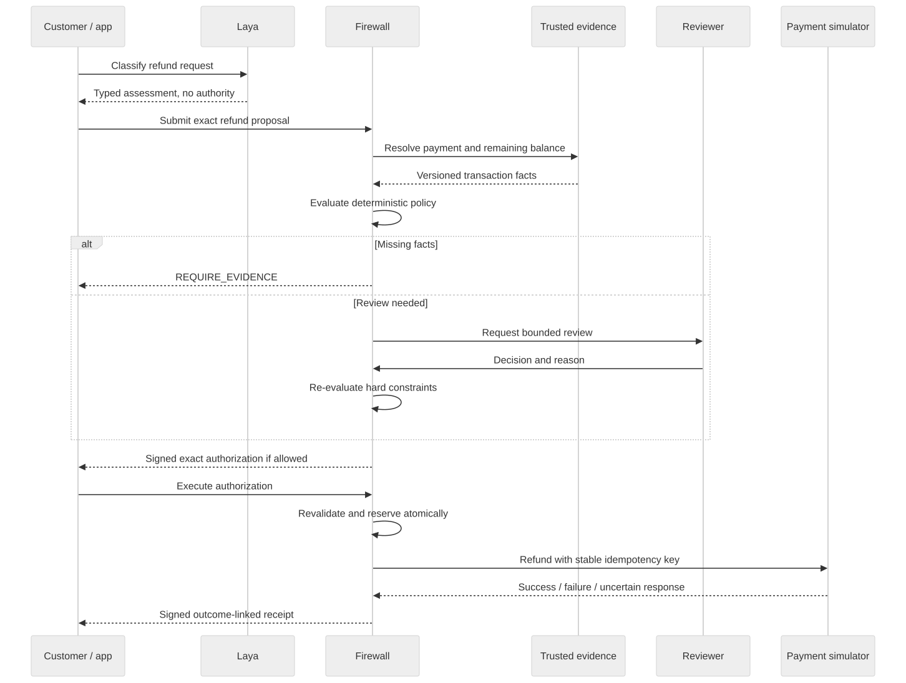

# Decision Firewall

**A model proposes a refund. Evidence, policy, and authority determine whether it executes.**

A provider-neutral Python SDK, CLI, and local inspector for the complete refund lifecycle:

**Intent → assessment → evidence → policy → review → authorization → execution → outcome.**

All financial operations use a durable local simulator. There is no connection to a real payment processor.



## Run locally on Windows

Use Python 3.12. From this repository in PowerShell:

```powershell
py -3.12 -m venv .venv
.\.venv\Scripts\python.exe -m pip install -r requirements-core.lock -r requirements-dev.lock
.\.venv\Scripts\python.exe -m pip install --no-deps -e .
.\.venv\Scripts\firewall.exe doctor
.\.venv\Scripts\firewall.exe demo
.\.venv\Scripts\firewall.exe serve
```

Open http://127.0.0.1:8765. The demo seeds 20 requests, including review, missing evidence, denials, successful refunds, and an unresolved response-loss example. Re-running `demo` preserves existing data.

On Linux, substitute `.venv/bin/python` and `.venv/bin/firewall`. The fixture workflow needs neither a GPU nor model weights.

## Local Laya

```powershell
.\.venv\Scripts\python.exe -m pip install torch==2.6.0 --index-url https://download.pytorch.org/whl/cu124
.\.venv\Scripts\python.exe -m pip install -r requirements-model.lock
.\.venv\Scripts\firewall.exe assess "I was charged twice. Please refund the duplicate INR 999." --provider laya --save .runtime/assessment.json
```

The adapter downloads only the pinned typed-decisions checkpoint. It runs one request at a time in FP32, reports its actual device, and limits material state to 256 tokens. Confidence is treated as uncalibrated. See [Windows setup](windows-setup.md) for CPU installation and resource limits.

## Benchmarks

```powershell
.\.venv\Scripts\firewall.exe benchmark runs/fixture --provider fixture
.\.venv\Scripts\firewall.exe benchmark runs/baseline --provider baseline
.\.venv\Scripts\firewall.exe benchmark runs/laya --provider laya
```

Each command requires a new output directory and produces raw observations, an exact dataset snapshot, JSON/CSV measurements, a Markdown summary, an HTML report, and reproducibility metadata. Forty curated scenarios plus 200 seeded text variations are split by family. Synthetic results do not establish production effectiveness. Fixture assessments use oracle labels and are not a learned-model baseline.

## Read next

- [Product and example policy](product.md)
- [Architecture and trust boundaries](architecture.md)
- [CLI walkthrough](walkthrough.md)
- [Threat model](threat-model.md)
- [Evaluation methodology](evaluation.md)
- [Implementation decisions](decisions.md)
- [Reference assessment](reference-assessment.md)
- [Verification evidence](verification.md)

## Development

```powershell
.\.venv\Scripts\python.exe -m pytest -q
.\.venv\Scripts\python.exe -m ruff check src tests scripts
.\.venv\Scripts\python.exe -m ruff format --check src tests scripts
.\.venv\Scripts\python.exe -m mypy src/decision_firewall
.\.venv\Scripts\python.exe -m build
```

GitHub Actions defines the model-free Windows/Linux test matrix; local verification does not imply that hosted CI has run. Diagrams are editable Mermaid with committed SVG exports. `scripts/render-diagrams.mjs` regenerates SVGs after installing the pinned documentation tooling.

## Boundaries

This is a single-operator local sandbox. OS access to the runtime directory establishes trust; seeded roles demonstrate separation but are not production IAM. The SQLite write lock serializes dispatch, favoring correctness over throughput. Production deployment needs authenticated workload identities, controlled credentials, non-bypassable payment routing, independent audit anchors, retention controls, and a real provider's idempotency/reconciliation contract.

New code is Apache-2.0. The contents of `refer/` retain their original rights; see `NOTICE`.

