# Threat model and limits

## Protected boundary

Protect a simulated refund from forged model authority, invented evidence, wrong destination/amount, stale approvals, replay, concurrent overspending, and ambiguous retries. The attacker may control message text, assessment contents, proposals, and copied/modified authorization tokens. The attacker cannot legitimately edit trusted SQLite files, keys, policies, or identity configuration.

| Failure | Control and evidence |
|---|---|
| High confidence with invalid transaction | Policy ignores confidence for permission |
| Self-declared reviewer | Trusted identity registry, fixed browser reviewer role |
| Modified authorization | Signature and exact ledger token comparison |
| Wrong action | Bound action hash plus explicit dispatch parameters |
| Revocation, evidence or policy change | Execution-time validation |
| Replay/concurrent execution | Atomic claim and downstream idempotency |
| Concurrent partial refunds | Reserved balances plus transactional downstream balance check |
| Lost response | UNKNOWN and same-key reconciliation |
| Audit unavailable before dispatch | Reservation transaction rolls back; no effect |
| Audit fails after downstream effect | Reserved state survives; reconciliation recovers |
| Malicious web origin | Loopback binding, host/origin validation, CSRF, SameSite session |
| Untrusted text in inspector | Jinja escaping and restrictive CSP |

## Explicit exclusions

The local operator can change files and keys, impersonate seeded roles through SDK calls, or manipulate evidence. The design does not defend against that operator. Public hosting is unsupported. Receipt signatures demonstrate integrity under trusted keys, not truth, completeness, legal compliance, or hidden model intent. Model classification can still be wrong; tests measure its influence separately. A complete threat review is required before connecting a real processor.

References and model weights may contain unsupported claims. They do not grant execution authority. Sensitive production data must not be placed in this synthetic sandbox.

