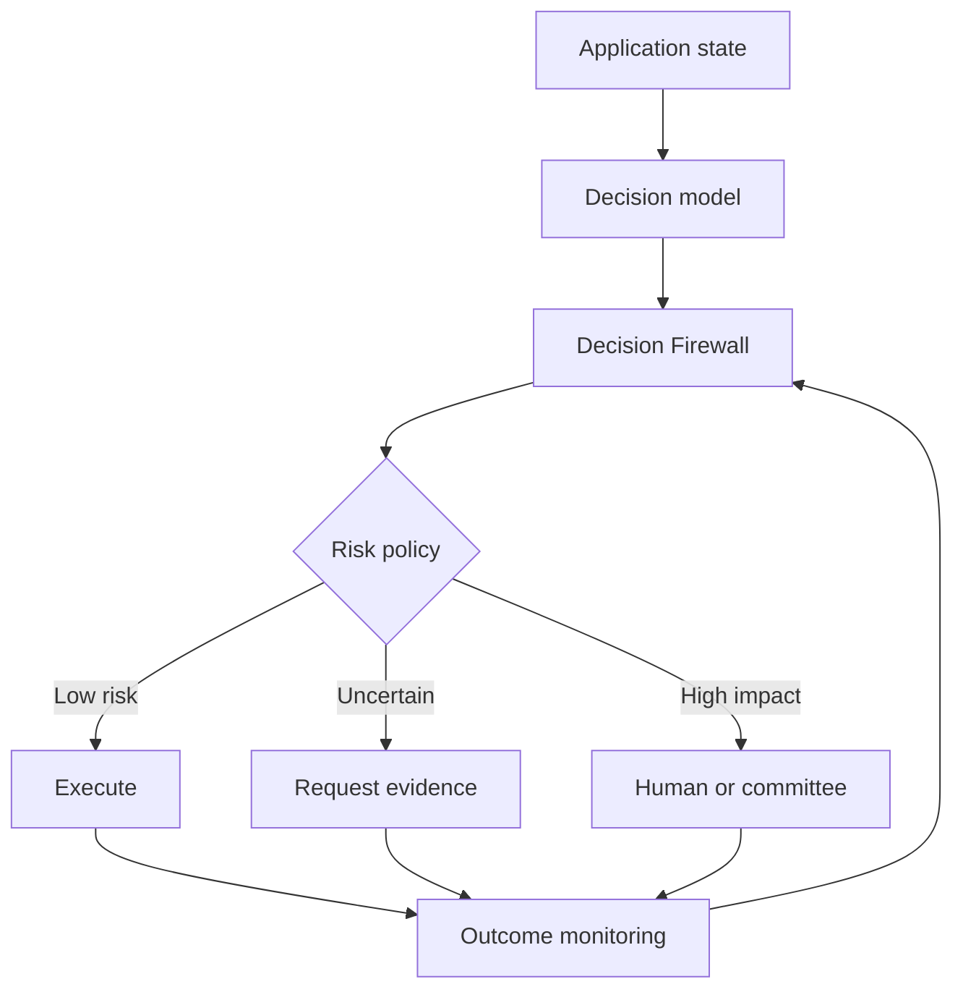

You mean **Jev**, the newly released decision model from TypeSafe AI.

Your concern is valid, but the risk is slightly different and arguably more serious than “the model may hallucinate.”

## First, what Jev actually is

Jev is a transformer-based model, but it is not designed to generate prose or explain a problem step by step. The application supplies:

- The relevant state or context
- A typed question
- The permitted choices

Jev returns structured outputs such as:

- A selected option
- Scores for alternatives
- Yes/no probabilities
- Confidence estimates

It is positioned as a “System One” model: fast, inexpensive judgment for routing, classification and operational decisions. Its outputs are constrained and type-safe, and TypeSafe claims the probabilities are calibrated. :chatgpt-content-reference{index="0"}

So your understanding is mostly correct:

> Jev is not specifically an RLHF or human-feedback model. It is a model optimized to make bounded, probabilistic decisions that software can execute.

However, one correction matters:

> Jev does not necessarily generate a visible “decision path.”

It may return:

```json
{
  "decision": "approve",
  "probability": 0.81
}
```

That tells us what it selected and how strongly, but not:

- Which evidence materially changed the decision
- Which criteria were applied
- What trade-offs were made
- Whether commercial interests influenced it
- What would have produced the opposite result

A probability is not an explanation.

## Why this creates a new category of risk

With ordinary generative AI, the output remains visible. Someone can read a generated report, inspect its claims and challenge it.

With a decision model, the output can disappear inside code:

```text
if approval_probability > 0.8:
    approve_application()
```

The user may never see the model, prompt, alternatives or confidence. They experience only the consequence.

That produces a shift:

> Generative AI can pollute content. Decision AI can silently alter outcomes.

And Jev’s speed and low cost make it possible to place hundreds of such judgments inside one workflow.

A recruiting system may use separate decisions for:

- Is this candidate relevant?
- Should we request additional evidence?
- Which interview should they receive?
- Is the inconsistency suspicious?
- Should the application be escalated?
- Is rejection sufficiently certain?

No single decision looks especially consequential. Together, they determine the candidate’s future.

## The monetization problem you identified

Suppose a travel agent has to choose between:

- The objectively best hotel
- A hotel paying a higher commission
- A promoted partner
- A hotel likely to reduce support costs

The system can still produce a mathematically plausible probability for the commercially preferred hotel.

Later, the provider can say:

- “The model was only 78% confident.”
- “Probabilistic systems occasionally make mistakes.”
- “The model considered several signals.”
- “No explicit rule preferred the sponsored option.”

This is not ordinary hallucination. It is **incentive laundering**: a commercial preference is converted into an apparently neutral model probability.

The same risk applies to:

- Loan approvals
- Insurance claims
- Employee screening
- Healthcare prioritization
- Product rankings
- News recommendations
- Supplier selection
- Fraud detection
- Agent tool selection
- Whether a complaint receives human attention

## Confidence can make this worse

A calibrated model can still be harmful.

If, across 1,000 decisions labelled 80% confident, approximately 800 are correct, it may be statistically calibrated. But it can still:

- Consistently disadvantage one subgroup
- Optimize for the wrong business objective
- Ignore an important but uncommon factor
- Prefer a commercially beneficial alternative
- Produce concentrated harm among the 200 failures
- Be correct according to a biased definition of “success”

So governance cannot stop at:

> “Was the probability calibrated?”

It must also ask:

> “Calibrated for whose objective, against which outcome, over which population, and with what cost when wrong?”

## What should be built

I would build a **Decision Firewall**, not merely another evaluator.

It would sit between decision models such as Jev and the systems capable of acting on their outputs:



The firewall would have six core capabilities.

### 1. Decision receipts

Every consequential decision creates an immutable, replayable receipt:

- Model and version
- Decision schema
- Input facts and their sources
- Available alternatives
- Selected alternative
- Probability distribution
- Applicable policy version
- Commercial relationships
- Threshold used
- Person or system accountable
- Whether a human could override it
- Eventual real-world outcome

This is much more useful than recording raw prompts.

### 2. Evidence provenance

Each decision should distinguish:

- Observed facts
- Inferred facts
- Missing information
- Policy constraints
- Model-generated judgments
- Commercial objectives

For example:

```json
{
  "observed": ["income_verified", "employment_3_years"],
  "inferred": ["repayment_risk_medium"],
  "missing": ["latest_tax_return"],
  "commercial_objective": "minimize_default_loss",
  "decision": "manual_review"
}
```

The important question is not “show me the model’s chain of thought.” Internal reasoning traces can be unreliable, manipulable and commercially sensitive.

The audit target should be:

> Which declared evidence, rule, objective and threshold produced this executable outcome?

### 3. Counterfactual testing

The validator should rerun the decision while changing one factor at a time:

- If the sponsored relationship were removed, would the choice change?
- If gender, age or location changed, would the outcome change?
- If the missing evidence were favourable, would the decision change?
- Would another model make the same choice?
- How close was the runner-up?
- Which minimal change flips the decision?

This exposes hidden sensitivity better than asking the model to explain itself.

### 4. Independent shadow judges

Do not allow the same provider to decide and certify its own decision.

For important actions, the platform could run:

- Jev as the primary decision-maker
- A deterministic policy engine for hard constraints
- A second model from another provider
- A domain-specific evaluator
- A human review path where disagreement is material

Escalation would be based on disagreement, expected harm and irreversibility, not confidence alone.

For example:

```text
Jev: approve, 84%
Policy engine: permitted
Independent model: reject, 61%
Outcome: do not auto-execute, escalate
```

This connects directly with your **Aikmat** idea. Aikmat could become the consensus and accountability layer around machine decisions, not just a multi-person ticket-refinement product.

### 5. Incentive and objective audits

Every decision endpoint should declare what it is optimizing:

- User value
- Revenue
- Conversion
- Risk reduction
- Cost reduction
- Engagement
- Regulatory compliance
- Some weighted combination

Then monitor whether behaviour matches the declared objective.

A recommendation system should not be allowed to say “best option” when it is actually optimizing:

```text
0.45 × user suitability
+ 0.35 × commission
+ 0.20 × supplier preference
```

The problem is often not a biased model. It is an undisclosed objective function.

### 6. Outcome-based monitoring

Most observability systems monitor model inputs and outputs. A decision-governance system must also monitor consequences:

- Who benefited?
- Who was rejected?
- Who appealed?
- Which decisions were overturned?
- Where did predicted probabilities differ from outcomes?
- Which groups carried most false positives?
- Did a model update alter approval rates?
- Did sponsored products suddenly become more likely to win?

This turns governance from paperwork into operational evidence.

## A useful risk model

Every decision could receive an execution-risk score based on:

\[
R = I \times U \times V \times A
\]

Where:

- \(I\) = impact if wrong
- \(U\) = uncertainty
- \(V\) = vulnerability to incentives or manipulation
- \(A\) = autonomy, or how directly the decision causes action

A low-confidence decision to choose a button colour is harmless.

A 94%-confidence decision to deny insurance may still require human review because impact and irreversibility are high.

Therefore:

> Confidence should influence escalation, but never determine governance by itself.

## Additional problems worth anticipating

Beyond direct commercial manipulation, I would watch for:

- **Decision monoculture:** Thousands of companies use the same model, causing correlated errors.
- **Objective drift:** The stated objective stays unchanged while weights or training data shift.
- **Threshold laundering:** The model remains unchanged, but a company changes the execution threshold from 0.85 to 0.61.
- **Context poisoning:** A vendor manipulates the state presented to the decision model.
- **Selective invocation:** The company calls the model only when it expects a commercially favourable answer.
- **Automation asymmetry:** Favourable decisions execute automatically; unfavourable ones receive scrutiny, or vice versa.
- **Appeal blindness:** The system learns from accepted decisions but never sees the true outcomes of rejected opportunities.
- **Proxy discrimination:** Protected attributes are removed, but location, language, employment gaps or device type recreate them.
- **False neutrality:** Structured probabilities appear more scientific than prose, even where the underlying question is fundamentally normative.
- **Responsibility diffusion:** The provider blames deployment, the deployer blames the model, and the human reviewer blames the confidence score.

## Does this already exist?

Parts of it exist, but the complete decision-runtime layer is still fragmented.

Platforms such as IBM watsonx.governance, Credo AI, OneTrust and conventional model-observability products cover model inventory, compliance, bias assessment, monitoring and documentation. :chatgpt-content-reference{index="1"}

NIST’s AI Risk Management Framework already organizes governance around **Govern, Map, Measure and Manage**, and explicitly treats human-AI arrangements as ranging from fully manual to fully autonomous. :chatgpt-content-reference{index="2"} The EU AI Act also establishes requirements around risk management, records, transparency and human oversight for high-risk systems. :chatgpt-content-reference{index="3"}

But most existing tools are oriented toward:

- Model registration
- Periodic risk assessment
- Compliance evidence
- Bias dashboards
- LLM tracing
- Organization-level governance

The product opportunity is narrower and more operational:

> A vendor-neutral control plane for every probabilistic decision before it becomes an action.

## My recommendation

Do not build a “Jev evaluator.” That would make the product dependent on one recently released model.

Build a **decision observability and enforcement protocol** that works with:

- Jev
- LLM-based judges
- Classical ML classifiers
- Rules engines
- Recommender systems
- Human approvals
- Multi-agent systems

The primitive should not be a prompt or completion. It should be a versioned object such as:

```text
Decision {
  question
  alternatives
  evidence
  constraints
  objectives
  probabilities
  selected_action
  execution_authority
  conflicts_of_interest
  review_policy
  outcome
}
```

My strongest version of the thesis would be:

> We built observability for what AI says.  
> Now we need observability for what AI decides, why that decision was allowed to execute, and who benefited from it.

That is a credible next layer after Jev, and it fits neatly with Aikmat: **Jev makes a judgment; Aikmat decides whether that judgment has sufficient agreement, evidence and authority to become an action.**